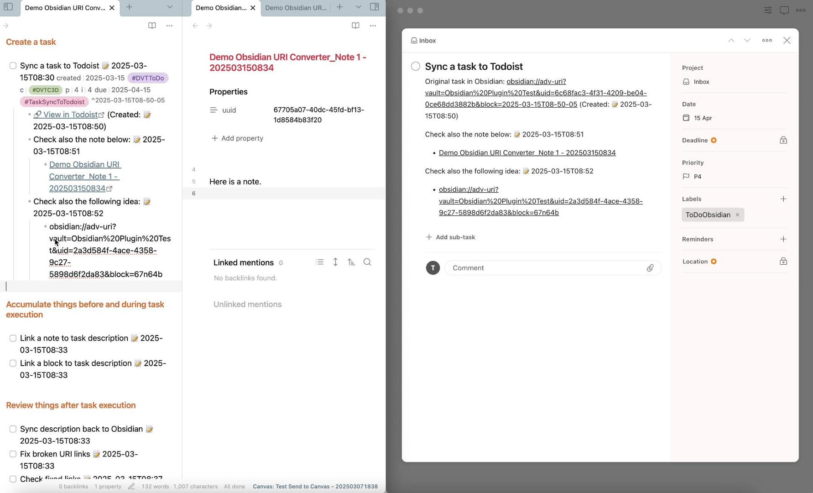

# URI Converter

 

An [Obsidian](https://obsidian.md/) plugin that converts Obsidian URIs to Obsidian internal links.

## Key Features of URI Converter

**URI Converter** supports the following features:

- Convert [Obsidian URIs](https://help.obsidian.md/Extending+Obsidian/Obsidian+URI) and [Advanced URIs](https://publish.obsidian.md/advanced-uri-doc/Home)
- Convert various URI types
    - Note links
    - Heading links
    - Block links
- Convert various link formats
    - Pure URIs, e.g., `obsidian://open?vault=my%20vault&file=my%20note`.
    - URIs of Markdown URL format, e.g., `[Any text or empty](obsidian://open?vault=my%20vault&file=my%20note)`.

## Videos and Articles

### Videos

### Articles

## Why You Need URI Converter

**URI Converter** was developed to address a specific challenge faced by Obsidian users, including myself. It embodies two essential [PTKM Core Principles](https://ptkm.net/ptkm-core-principles) that shape its functionality:

- **Providing Context**: Ensuring no valuable information is lost in the task management process
- **Linking Everything**: Bridging the gap between Obsidian and Todoist

### The Challenge

As an avid Obsidian user, I frequently copy links to notes, headings, or blocks and use them in external apps like Todoist. These links provide valuable context for tasks in Todoist, but they didn't function as bidirectional links within Obsidian when copied back. This disrupted the seamless navigation and connection that Obsidian is known for.

### The Solution

**URI Converter** was created to automate the conversion of external links into Obsidian-compatible internal links. With the URI Converter, you can:

1. **Automate Link Conversion**: Save time by automatically converting external links to internal Obsidian links
2. **Maintain Bidirectional Links**: Preserve the powerful linking capabilities of Obsidian
3. **Enhance Workflow Efficiency**: Integrate seamlessly with external apps like Todoist
4. **Focus on Productivity**: Spend less time on manual tasks and more on what matters

## Documentation

📚 **[View Full Documentation](https://ptkm.net/obsidian-uri-converter)**

Visit the documentation site to learn how to make the most of URI Converter in your Obsidian workflow.

## Support & Community

This plugin is a labor of love, developed and maintained during my free time after work and on weekends. A lot of thought, energy, and care goes into making it reliable, user-friendly, and aligned with PTKM principles.

If you find this plugin valuable in your daily workflow, please consider supporting my work. Your support would mean the world to me and would help me dedicate more time and energy to:

- Developing new features
- Maintaining code quality
- Providing support and documentation
- Making the plugin even better for everyone

### Ways to Support

You can support this project in several ways:

- ⭐ Star the project on GitHub
- 💝 
- [Sponsor](https://github.com/sponsors/wenlzhang) my work on GitHub
- 💌 Share your success stories and feedback
- 📢 Spread the word about the plugin
- 🐛 [Report issues](https://github.com/wenlzhang/obsidian-uri-converter/issues) to help improve the plugin

Thank you for being part of this journey! 🙏
